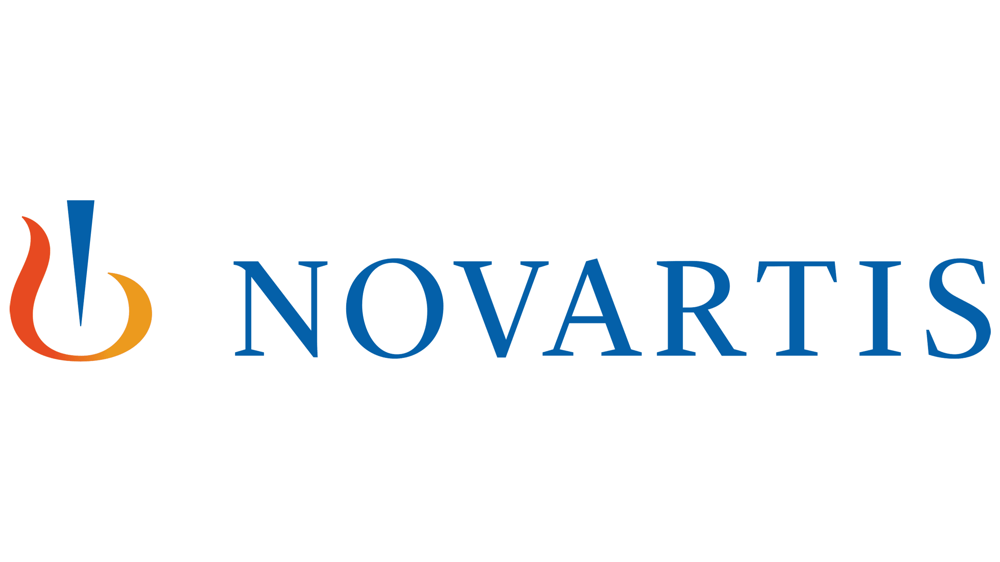
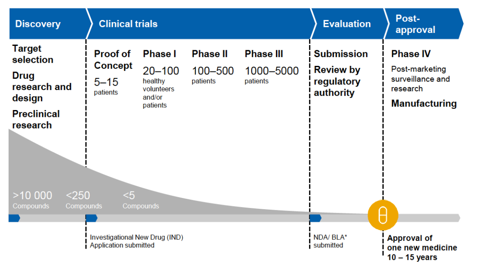
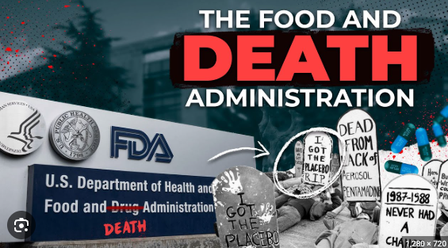
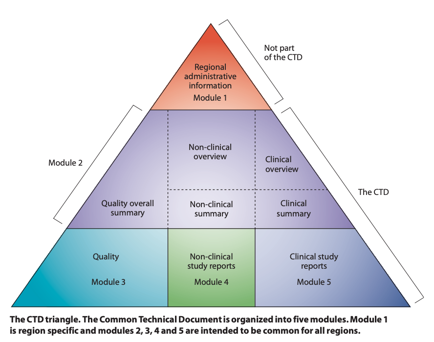
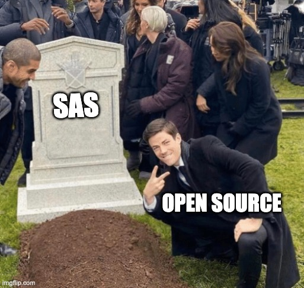

## Introduction

::: {.fragment}
{.absolute top=60 left=700 width="200"}

* 8 years in oncology research
* 5 years in an internal CRO (-omic biomarkers)
  * including validation and qualification
:::

::: {.fragment}
{.absolute top=10 left=700 width="80"}
{.absolute top=10 left=770 width="80"}

* Minneapolis-St Paul "city captain" for Bits-in-Bio
* R/Pharma and `{pharmaverse}` contributor
:::

::: {.fragment}
{.absolute top=5 left=850 width="100"}

* This talk will have more drugs / biologics focus than devices
* This talk will have more R information than Python
:::
{.absolute top=5 left=600 width="80"}

# Getting to know the FDA

## Organization / Submissions {.smaller}
* Top-level organization within [Health and Human Services]{.rn-fragment rn-type=underline rn-color=red}
* Sub-organizations
  * Center for Drug Evaluation and Research [(CDER) &rarr; drugs]{.rn-fragment rn-type=circle rn-color=blue} (and some biologics)
  * Center for Biologics Evaluation and Research [(CBER) &rarr; biologics]{.rn-fragment rn-type=circle rn-color=blue} (and some devices)
  * Center for Devices and Radiological Health [(CDRH) &rarr; devices]{.rn-fragment rn-type=circle rn-color=blue} (and therapeutic apps)
* _**Submission**_ Types
  * Device submissions based on risk - Class I / II / III
  * Investigational exemption to run trials - [IND (drug / biologic), IDE (device)]{.rn-fragment rn-type=highlight}
  * Prescription drug - [NDA (new drug application)]{.rn-fragment rn-type=highlight}, ANDA (new generic)
    * For new indication - sNDA or 505(b)(2)
    * For non-prescription - OTC (over-the-counter) or "Rx-to-OTC" switch
  * Biologics / Biosimilars - [BLA (therapeutic biologic application)]{.rn-fragment rn-type=highlight}
  * Class II / III devices - [510(k) (substantially equivalent) or PMA (Pre-Market Approval)]{.rn-fragment rn-type=highlight}

## Drug Discovery and Development
{width=95%}

## History up to 1962 {.smaller}
{.absolute top=0 left=900 width="200"}

::: {.timeline .horizontal .fragment-slide}

::: {.event data-label="1902"}
**Biologics Control Act**

Ensure purity and safety of serums, vaccines and similar products

<!-- Enforced by US Public Health and Marine-Hospital Service Hygienic Laboratory -->
<!-- death of children -->
:::

::: {.event data-label="1906"}
**Pure Food and Drugs Act**

Prohibits sale of misbranded (strength, purity) and adulterated foods, drinks, and drugs

<!-- Enforced by USDA Bureau of Chemistry -->
:::

::: {.event .fragment data-label="1910"}
**US vs Johnson**

Supreme Court says PF&D Act doesn't cover false _therapeutic claims_
:::

::: {.event .fragment data-label="1912"}
**Sherley Amendment**

Prohibits false therapeutic claims with intent to defraud
:::

::: {.event .fragment data-label="1930"}
**FDA created**

Originally, the Food, Drug, _and Insecticide_ Administration (1927)
:::

::: {.event .fragment data-label="1938"}
**Food, Drug, and Cosmetic (FD&C) Act**

Replaces the PF&D Act and Sherley Amendment [(after 5 years debate)]{.rn-fragment rn-type=circle rn-color=blue}

Manufacturer has to show a drug is [safe before it can be marketed (NDA submission)]{.rn-fragment rn-type=highlight rn-multiline=true}

<!-- Required adequate labeling for safe use, safe tolerances for poisons and authorized factory inspections -->
<!-- NDA is approved after certain time period -->
<!-- Extended control to cosmetics and therapeutic devices -->
<!-- took someone selling anti-freeze as a drug solvent -->
:::

::: {.event .fragment data-label="1951"}
**Durham-Humphrey Amendment**

Certain drugs labeled as prescription-only with refill rules
:::

::: {.event .fragment data-label="1962"}
**Kefauver-Harris Drug Amendments**

Have to show a drug is [safe AND effective for intended use]{.rn-fragment rn-type=highlight rn-multiline=true}

Evidence must consist of adequate, [well-controlled studies (IND submission)]{.rn-fragment rn-type=underline rn-color=red rn-multiline=true}

Submissions have no data standards, loose document structure, and reams of paper
:::

:::

## 1970s {.smaller}

{.absolute top=5 left=700 width="300"}

* OTC safety and effectiveness rules - 1972
* Biologics moved from NIH to FDA - 1972
* Medical devices added to FD&C Act - 1976
* [Drug Efficacy Study Implementation \(DESI\)]{.rn-fragment rn-type=underline rn-color=red} - starts 1968, 1st report 1973
  * Review efficacy for drugs approved from 1938-62 (based on safety only)
* Still - no data standards, no document structure, all paper
* [SAS programming language - proprietary commercial]{.rn-fragment rn-type=highlight}
  * Software validation (mostly) handled for you

## 1980s {.smaller}

{.absolute top=5 left=650 width="350"}

* IRBs / Informed Consent rules - 1981
* [Current organization structure]{.rn-fragment rn-type=highlight} - 80s
  * Center for Drugs and Biologics created - 1982
  * CDRH is created - 1984
  * CDB split into CDER and CBER - 1987
  * Food and Drug Act - moves FDA to HHS - 1988
* [Orphan Drug Act, Anti-Tampering Act, Direct-to-Consumer Drug Ads]{.rn-fragment rn-type=circle rn-color=blue rn-padding=20} - 1983
* [DESI final report]{.rn-fragment rn-type=underline rn-color=red} - 2225 effective, 1051 not effective, 167 pending (3443 total) - 1984
* Generics (ANDA submissions) - 1984
* [Access to investigational drugs / accelerated approvals]{.rn-fragment rn-type=underline rn-color=red} - 1987+
* [FDA rules on format for a submission (12 sections) - still mostly paper]{.rn-fragment rn-type=highlight}
* SAS XPT (v5) data file format _created_ - 1989

## 1990s {.smaller}

* Prescription Drug User Fee Act - 1992
* [Trials should include women]{.rn-fragment rn-type=bracket rn-brackets=left,right rn-color=red} - 1993
* Post-marketing safety (MedWatch) - 1993
* Food and Drug Modernization Act - 1997
* [Trials to analyze by age, gender, and race]{.rn-fragment rn-type=bracket rn-brackets=left,right rn-color=red} - Demographics Rule - 1998
* FDA clinical trial registry - ClinicalTrials.gov - 1999
* [Submissions move from paper to electronic (PDFs and more)]{.rn-fragment rn-type=highlight}
* Submissions include code, spreadsheets, databases - sponsors would loan PC to FDA
* [SAS XPT (v5) is required for data - 1999]{.rn-fragment rn-type=highlight}
* FDA is founding member of [ICH (1990)]{.rn-fragment rn-type=highlight} and [CDISC (2000)]{.rn-fragment rn-type=highlight} - STANDARDS-ish!

<!--
 Food and Drug Modernization Act
 - reauth'd the user fees
 - biologics similar to drugs
 - off-label use promoted by pharma
 - pharmacy compounding
 - risk based classification for devices
 - reinventing government (internet!)
-->
<!-- 
  Changes since 2000
  2003 - shuffle things between CDER and CBER
  2010 - biosimilars
  2017 - eCTD is required
  2022 - removal of requirement for rodent/non-rodent 
-->

## ICH - `www.ich.org` {.smaller}

* The "United Nations" for regulatory agencies (RA)
  * Officially the "International Council for Harmonization of Technical Requirements for Pharmaceuticals for Human Use"
* Guidelines
  * Identified with pattern \<A\>\<N\> - with potential revisions (R\<N\>)
  * [Q for Quality, S for Safety, E for Efficacy, M for Multi-Disciplinary]{.rn-fragment rn-type=highlight}
* Each RA implements these as regulations
  * [For FDA, this is Title 21 of the Code of Federal Regulations (CFR)]{.rn-fragment rn-type=highlight}
  * 21 CFR is all the regulations of the FDA, DEA, and ONDCP
  * Divided into chapters and sub-chapters (FDA is Chapter I, Subchapters A through L)
  * Divided into parts assigned to sub-chapters (FDA is parts 1-1299)
  * eg. Part 11 covers computer system / software validation
  * [FDA provides a lot more documentation than just the 21 CFR regulations]{.rn-fragment rn-type=underline rn-color=red}

## ICH Guidelines (highlights) {.smaller}

:::: {.columns}

::: {.column width="50%"}
_**Quality**_

**Q7** Good Manufacturing Practice

**Q8** [Pharmaceutical Development]{.rn-fragment rn-type=highlight fragment-index=1}

**Q9** [Quality Risk Mgmt]{.rn-fragment rn-type=highlight fragment-index=2}

**Q10** Pharmaceutical Quality System

_**Efficacy**_

**E3** [Clinical Study Reports]{.rn-fragment rn-type=highlight fragment-index=3}

**E6** Good Clinical Practice

**E8** Trial Design

**E9** [Statistics for Clinical Trials]{.rn-fragment rn-type=highlight fragment-index=4}
:::

::: {.column width="50%"}
_**Multi-Disciplinary**_

**M1** [MedDRA Terminology]{.rn-fragment rn-type=underline rn-color=red fragment-index=5}

**M2** Electronic Standards

**M4** [Common Technical Document (CTD)]{.rn-fragment rn-type=highlight fragment-index=7}

**M5** [WHODrug Terminology]{.rn-fragment rn-type=underline rn-color=red fragment-index=6}

**M8** [Electronic CTD (eCTD)]{.rn-fragment rn-type=highlight fragment-index=8}

**M10** Bioanalytical Method Validation

**M11** [Clinical electronic Structured Harmonized Protocol (CeSHarP)]{.rn-fragment rn-type=circle rn-color=blue rn-multiline=true fragment-index=9}

_**Safety**_

**S1** Carcinogenicity

**S4** Toxicity

**S7** Pharmacology Studies
:::

::::

## CTDs, eCTDs, and CSRs {.smaller}

{.absolute top=50 left=700 width="300"}

* 5 Modules
  * M1 Administrative (RA-specific)
  * M2 Overviews and Summaries
  * M3 Quality
  * M4 Non-clinical study reports
  * M5 Clinical study reports
* eCTD is a digital version of this (folder / file structure)
  * eCTD v4 is just now accepted by FDA
* CSR is a clinical study report and is the contents of "m5"
  * Online books for this for [R](https://r4csr.org){target="_blank"} and [Python](https://pycsr.org){target="_blank"}

## CDISC - `www.cdisc.org` {.smaller}

* Global non-profit setting data standards for clinical trials
* Foundational standards are all XML-based
* Most specifications are "guidelines" and come with implementation guides
  * Some guides are based on therapeutic area
* Like ICH, also have their own controlled terminologies / biomedical concepts
* Runs various initiatives - digital technologies, 360i ("AI")
* Runs [COSA - CDISC Open-Source Alliance]{.rn-fragment rn-type=underline rn-color=red}
* Works with other standards organizations - FHIR, OHDSI
* ["Define" the main data standards to be included in the CSR]{.rn-fragment rn-type=highlight}
* Different RAs have different rules on use of CDISC
* For FDA, CDER/CBER have different rules from CDRH

## CDISC standards {.smaller}

* USDM - Unified Study Definitions Model
* CDASH (IG) - Clinical Data Acquisition Model
  * Model for [capturing data from a Clinical Report Form (CRF)]{.rn-fragment rn-type=underline rn-color=red}
* SDTM (SENDIG - non-clinical, SDTMIG - clinical) - Study Data Tabulation Model
  * Model to [organize and format data from trials]{.rn-fragment rn-type=underline rn-color=red}
* ADaM (IG) - Analysis Data Model
  * Model for [analysis-ready datasets]{.rn-fragment rn-type=underline rn-color=red}
* Analysis Results Standard - Model (ARM) and Dataset (ARD)
  * Model (and meta-model) [for statistical output from ADaM data]{.rn-fragment rn-type=underline rn-color=red}
  * This can be input data for Tables, Listings, and Figures (TLFs)
* Data flow
  * [CRF]{.rn-fragment rn-type=highlight} &rarr; EDC &rarr; [SDTM data]{.rn-fragment rn-type=highlight} &rarr; [ADaM data]{.rn-fragment rn-type=highlight} &rarr; ARD &rarr; [TLF for PDFs]{.rn-fragment rn-type=highlight}
  * Metadata for all of this (traceability, quality) - common file is [define.xml]{.rn-fragment rn-type=highlight}

# The Shift to Open Source

## SAS (closed) to Open Source {.smaller}

* Most trials have a data flow - CRF &rarr; SDTM &rarr; ADaM &rarr; TLFs / PDF
* Trial data (versioned / tagged) - based on CDISC, [typically SAS data files (`sas7bdat`)]{.rn-fragment rn-type=highlight}
* Trial code (versioned / tagged) - raw to SDTM to ADaM to TLFs is [all SAS code]{.rn-fragment rn-type=highlight}
* CSR files (in the eCTD) are [SAS code and SAS XPT (v5) data files]{.rn-fragment rn-type=highlight}
* FDA runs your [SAS code on Windows]{.rn-fragment rn-type=highlight} (their environment)
* R (v3 in 2015, v4 in 2020) and Python (v3 in 2008) can technically do this
  * Most folks are now learning R and Python
* Can we move off of SAS?
  * [Internal data can be anything]{.rn-fragment rn-type=underline rn-color=red} - need versioning and tagging
  * 21 CFR Part 11 - need to [validate core statistics and packages used]{.rn-fragment rn-type=underline rn-color=red}
  * FDA needs to be able to [run what we send]{.rn-fragment rn-type=underline rn-color=red} (and code transfer is text-only)
  * SAS XPT (v5) is still required for data transfer - but we can [make that with R / Python]{.rn-fragment rn-type=underline rn-color=red}

## R Consortium {.smaller}

* The [R Consortium](https://r-consortium.org){target="_blank"} does all things R
  * Projects - RLadies+, R-Universe, and DBI
  * Events - R/Medicine, UseR!, LatinR, etc.
  * Grants - Twice-annual grant submissions - Apr /Sep
  * Lots of working groups - many related to clinical trials
    * `{nlmixr2}` package for PK/PD calculations
    * R Tables for Regulatory Submission (RTRS)
    * [[Submissions](https://rconsortium.github.io/submissions-wg/){target="_blank"}]{.rn-fragment rn-type=highlight}
    * [[R Validation Hub](https://pharmar.org){target="_blank"}]{.rn-fragment rn-type=highlight}
* Submissions group runs pilots with FDA to prove this out
  * Started in 2021 - 7 pilots defined so far (5 are completed)
* R Validation Hub  a risk-based approach to R / package validation
  * Started in 2018

## PHUSE {.smaller}

* [PHUSE](https://phuse.global){target="_blank"} - Global Healthcare Data Science Community
  * "Get-Stuff-Done" organization that works with CDISC
  * Funding from RAs and Pharmas - started 2004
  * Lots of working groups - everyone is involved
    * [CAMIS](https://psiaims.github.io/CAMIS/){target="_blank"} - Comparing Analysis Method Implementations in Software
      * Part of Data Visualization and OS Tech working group
      * Prove out core stats in SAS, R, and Python
    * [pharmaverse](https://pharmaverse.org){target="_blank"} working group
      * Started as it's own thing and then became a PHUSE working group
  * Main event is "Connect" (US, EU, APAC) and hackathons

## `{pharmaverse}` and \*/Pharma {.smaller}

* R packages - CSR data (SDTM/ADaM/ARS/TLFs), submissions, and validation
* Community - slack, blog, examples, YouTube videos
* Organized around [4 pillars](https://pharmaverse.github.io/blog/posts/2026-02-26-pharmaverse-pillars/pharmaverse-pillars.html){target="_blank"} - council members from pharma
  * OS Software Solutions, Community, PHUSE WG, Future Focus
* [R/Pharma](https://rinpharma.com){target="_blank"} is a related group for events and hosts
  * GenAI virtual conference (Jun)
  * In-person "Summit" day prior to posit::conf (Sep)
  * R/Pharma virtual conference (Oct)
  * R/Pharma Hangouts (monthly)
  * Diversity Alliance Hackathon
* [Open Source in Pharma](https://opensourceinpharma.com){target="_blank"} is a non-profit with similar aim as R/Pharma for ALL languages

## `{pharmaverse}` Packages {.smaller}

* [SDTM packages](https://pharmaverse.org/e2eclinical/sdtm/){target="_blank"} for converting CRF/raw data to SDTM
* [ADaM packages](https://pharmaverse.org/e2eclinical/adam/){target="_blank"} for converting SDTM data to ADaM
* [TLGs packages](https://pharmaverse.org/e2eclinical/tlg/){target="_blank"} for creating ARM/ARD data, TLFs, interactive apps, etc.
* [eSub packages](https://pharmaverse.org/e2eclinical/esub/){target="_blank"} for creating data files needed for eCTD submissions
* [Metadata packages](https://pharmaverse.org/e2eclinical/metadata/){target="_blank"} for meta-data driven study data flows
* [Utility packages](https://pharmaverse.org/e2eclinical/utility/){target="_blank"} for architectural concerns (logging, diffs)
* [Developers packages](https://pharmaverse.org/e2eclinical/developers/){target="_blank"} for validation, CI/CD, data
* and [examples](https://pharmaverse.github.io/examples/){target="_blank"} you can run on Posit Cloud or locally

## Where we at? {.smaller}

* Submissions
  * Pilots - execute R, custom packages, `{shiny}` apps, `{renv}`, podman, WebAssembly, dataset-json
  * FDA regulatory changes on using `.zip` files for custom R packages
* Validation
  * Packages to collect risk metrics, publish to repository, generate documentation
* ICH / FDA / CDISC
  * M11 and USDM, automation / "AI" / 360i, FDA "real-time" trials, [dataset-json](https://brianrepko.github.io/blog/index.html#category=pharmaverse){target="_blank"}
  * Supporting SAS XPT (v5) is the reason we can't have nice things
* Successes
  * Novo Nordisk committed all new trials to R - [first R-based submission](https://posit.co/about/customer-stories/novo-nordisk){target="_blank"} to FDA
  * Roche [webinar on their first R-based submission](https://posit.co/blog/roches-first-end-to-end-r-journey-to-submission){target="_blank"} to FDA, EMA, and NMPA
  * ["Phil's list"](https://github.com/philbowsher/Open-Source-in-New-Drug-Applications-NDAs-FDA){target="_blank"}

## Questions

:::: {.columns}

::: {.column width="50%"}

* The future of working with the FDA is based on open source technologies
* THANK YOU!!
:::

::: {.column width="40%"}

{width="400"}
:::

::::
